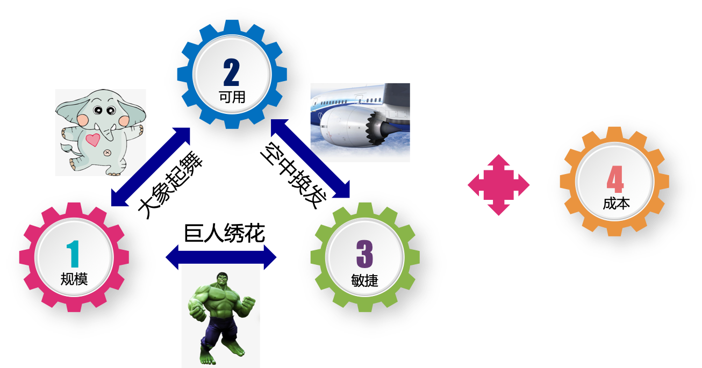

### 关键目标

根据前面对云计算历史的追溯，对云原生出现背景的分析，以及对不同时期云原生定义的回顾总结，这里给出云原生的几个关键目标：

- 规模：

	要求云原生服务能够适应不同的规模（包括但不限于用户规模/部署规模/请求量），并能够在部署时动态分配资源，以便在不同的规模之间快速和平滑的伸缩。典型场景如：初创公司或新产品线快速成长，用户规模和应用部署规模在短时间内十倍百倍增长；促销、季节性、节假日带来的访问量波动，高峰时间段的突发流量等。

- 可用：

	通过各种机制来实现应用的高可用，以保证服务提供的连续性。

- 敏捷

	快速响应市场需求

- 成本

	充分有效的利用资源

> TBD：这里稍后补充详细信息。

### 解决各目标之间的冲突

在这四个核心目标之间，存在彼此冲突的情况：

- 规模和敏捷之间的冲突：

	规模大而又要求敏捷，我们比喻为“大象起舞”。

- 规模和可用性之间的冲突：

	规模大而要求可用性高，我们比喻为“巨人绣花”。

- 敏捷和可用性之间的冲突：

	敏捷而要求高可用，我们比喻为“空中换发”。

而云原生应用，必须要在同时满足这三个目标的前提下，还要实现成本控制。

稍后的章节，将通过飞轮效应来讲解云原生是如何逐步产生并积累出来的，并在云原生特征中将这四个核心目标拆解为十几个特征来分别介绍各个目标的达成方式。后面会详细讲解云原生的代表技术和理念是如何围绕这些核心目标和特征来实现的。