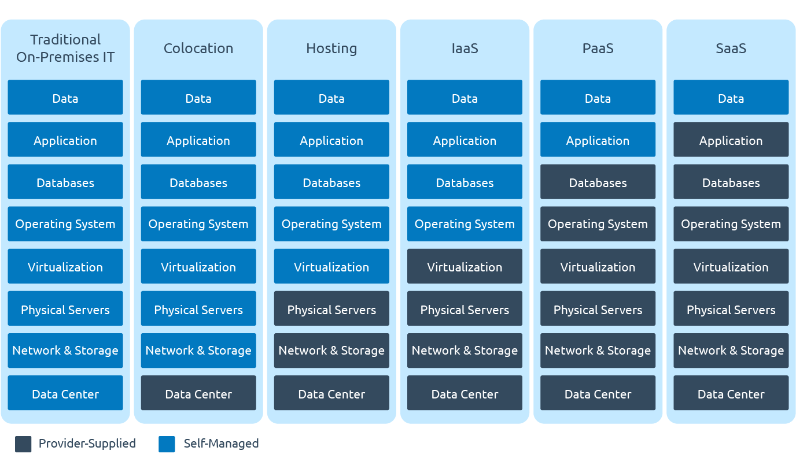

在介绍云原生之前，先看看过去20年间，云计算领域的发展演进历程。

## 二十年演进历程

在2000年，Sun时代，还没有虚拟服务器。当时如果要启用一个新的应用，需要购买一台或者一个机架的新服务器。应用程序的基本构建块是物理机。

2001年，VMWare带来了虚拟化计划，开始推广虚拟机（VM）的概念。通过虚拟机，可以在同一台物理机器上运行多个虚拟机，这意味着可以降低服务器的数量。此时的构建块变成了虚拟机。

在2006年，Amazon Web Service （也就是大家熟悉的AWS）通过提供 Elastic Compute Cloud （同样是大家熟悉的EC2）创立了 IaaS （Infrastructure-as-a-Service）市场。通过按时计费的方式租借服务器，将资本支出（Capex）转变为运营支出（Opex），这是云计算（Cloud Computer）的真正开始。此时构建块依然是虚拟机，称为Amazon Machine Image(AMI)。

术语介绍，**Capex Vs. Opex**：

- Capex = capital expenditure / 资本支出
- Opex =  operational expenditure / 运营支出

2009年，Heroku 推进 PaaS （Platform-as-a-Service）。此时构建块不再是虚拟机，而是 buildpack/构建包，集装箱式的12因素应用由此诞生。此时构建集装箱的过程依然是不透明的，但是部署应用的新版本就很简单了。

对应用的开发者而言，此时最大的变化是：终于可以更多的关注应用，而不必太考虑机器。

2010年，openstack 以汇集各种供应商的方式开创了IaaS的开源时代，和AWS、VMWare竞争。此时构建块还是虚拟机VM，但云计算已经开始进入开源时代。

2011年，继开源版IaaS之后，Pivotal推出了开源版PaaS Cloud Foundry，作为Heroku PaaS的开源替代品，并于2014年底推出了Cloud Foundry Foundation。构建块是Garden container，它可以容纳Heroku构建包，Docker容器甚至非Linux操作系统。（补充：Cloud Foundry是一个长期演进的体系，现在都已经支持k8s和Istio了）。

2013年，Docker组合LXC，Union File System和cgroups等Linux技术创建容器化标准，docker风靡一时，container逐步替代VM，云计算进入容器时代。容器技术应该是过去十年对软件开发行业改变最大的技术。容器技术极大的推动了隔离，重用和不可变性的设计思潮，尤其是不可变性。

2015年，Cloud Native 出现，完全基于开源软件技术栈，Cloud Native 的重要理念是：以微服务的方式部署应用，每个应用都打包为自己的容器并动态编排这些容器以优化资源利用。

在2017和2018年，kubernetes 在和Mesos和Swarm的史诗大战中获胜，彻底击败对手，赢得容器编排市场的统治地位。以kubernetes为核心的CNCF Cloud Native生态系统也得以迅猛发展，云原生成为云计算市场的技术新热点。

## 演进总结

从上面演进历史，可以发现以下规律：

- 核心构建块的变化：

	从早期的物理服务器，通过虚拟机计划演进为虚拟机，再摆脱机器的限制缩小为构建块，最后通过容器化技术演进为目前的container

- 隔离单元：无论是启动时间还是单元大小，物理机、虚拟机、容器一路走来，实现了从重量级到轻量级的转变

- 不可变性：构建块越来越小，隔离单元越来越轻，不可变性由此出现，From pets to cattle 成为云计算时代的重要变化之一。

- 技术提供者：从闭源到开源，从单一供应商到跨越多个供应商

下图形象的概述了这二十年云计算的过程：从传统预制IT、托管到云，以及云的不同形态如IaaS、PaaS、SaaS等。

在这过去的二十年间，云计算几乎重新定义了整个行业的格局，越来越多的企业开始降低对IT基础设施的直接资本投入，不再倾向于维护自建的数据中心，而是开始通过上云的方式来获取更强大的计算、存储能力，并实现按时按需付费。这不仅仅降低IT支出，同时也降低了整个行业的技术壁垒，使得更多的公司尤其是初创公司可以更快地实践业务想法并迅速推送到市场。

### 参考资料

- CNCF的介绍资料 [Cloud Native and Container Technology Landscape](https://events.static.linuxfound.org/sites/events/files/slides/(OSF_Mr.%20Chris%20Aniszczyk)CNCF%20(OS%20Forum%20Japan%202016).pdf)
- [What is XaaS? IaaS vs SaaS vs PaaS: what’s the difference](https://www.ispsystem.com/news/xaas)：对XaaS的概括介绍

