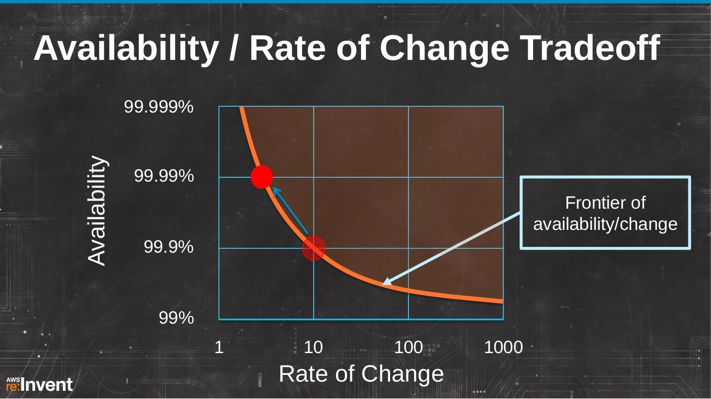
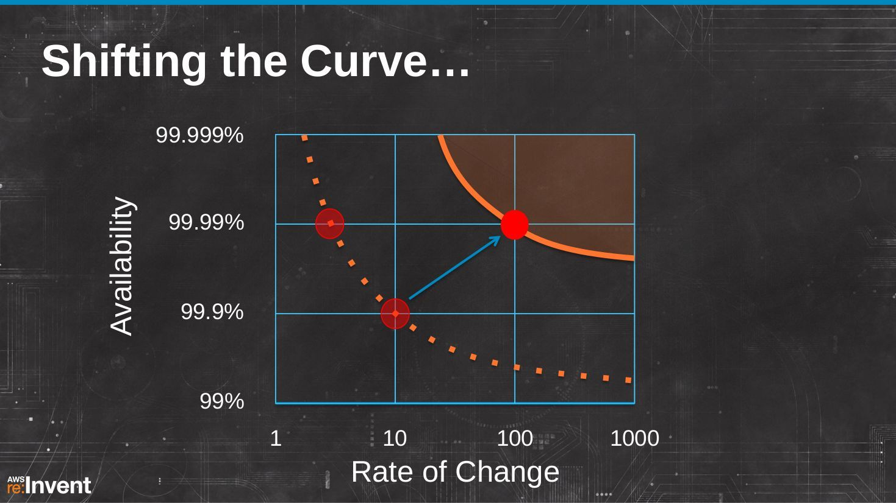

## 隔离性/Isolation

以容器方式打包的应用程序实现了 dev/prod 的一致性，促进代码和组件重用并简化运维。

我们以Netflix公司的例子来看，Netflix 给自己定的目标:

- Availability：可用性优先考虑，要求4个99（99.99%）
- Scale：然后是可扩展性，满足业务增长是硬性需求
- Performance：再是性能

但是当服务的依赖增加时，可用性会下降，图中表格显示可用性为99.99%的服务在服务依赖数量增加时可用性下降的趋势。

为了在有1000个组件的情况下继续保持4个9的可用性，有两条途径：

- 如果组件失败会导致系统失败，则要求每个组件达到6个9，这个难度很大，尤其成本会无法控制
- 或者，如果组件失败可以降解而不是导致系统失败，则可以隔离非依赖服务的影响

而仅有Availability, Scale, Performance 是不够的! 还必须实现快速迭代，提高变更速度。而变更会导致bug，变更速度对可用性造成负面影响：

可用性和变更速度之间的矛盾: 当变更速度增加时，可用性下降。要提高可用性，则要求降低变更速度：

但是现在的目标是，必须改变曲线，同时实现提高可用性和增加变更频率：

这就必须打破导致级联系统失败的级联依赖，实现子系统隔离: 让失败只发生在一个组件中，而绝不导致级联系统失败。

而子系统隔离需要实现：

- 具备超时和故障转移能力的冗余系统：当超时时可以有默认相应作为fallback
- 金丝雀推出 （Canary Push）
- 蓝绿部署：应该就是现在常说的蓝绿部署
- 灰度发布：先小范围试错，验证OK再全面上线
- Zone Isolation：区域隔离，以应对基础设施失败，如电力故障
- Region Isolation：地域隔离，通过DNS等技术手段切换Region

## 不绑定/No Lock-in

开源软件堆栈支持在任何公有云或私有云（或两者组合的混合云）上部署，避免Cloud绑定（供应商绑定）。

- Software is eating the world
- Open Source is eating Software
- Cloud is eating Open Source

如果没有通用开源软件，我们将冒着Cloud绑定的风险。

## 可扩展性/Scalability

针对现代分布式系统环境进行了优化，能够扩展到数万个自我修复的节点。

## 效率/Efficiency

通过中央编排过程实现了微服务的动态管理和调度，提高了效率和资源利用率，降低了与维护和运营相关的成本。

## 弹性/Resiliency

应对单个容器，机器甚至数据中心的故障，满足不同水平的需求。

### 参考资料

- CNCF的介绍资料 [Cloud Native and Container Technology Landscape](https://events.static.linuxfound.org/sites/events/files/slides/(OSF_Mr.%20Chris%20Aniszczyk)CNCF%20(OS%20Forum%20Japan%202016).pdf) 

- [“What is Cloud Native and why should I care”](https://www.cncf.io/wp-content/uploads/2017/11/What-is-Cloud-Native-CNCF-Webinar-23-Feb-2017-1.pdf)  来自 Alexis Richardson

